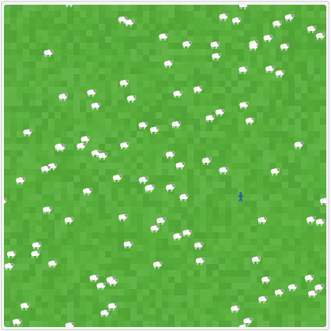
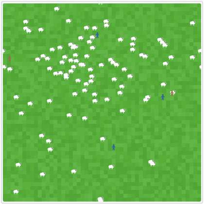
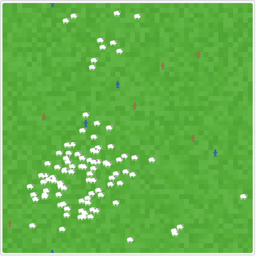
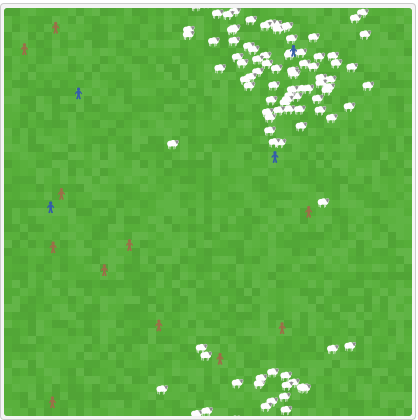
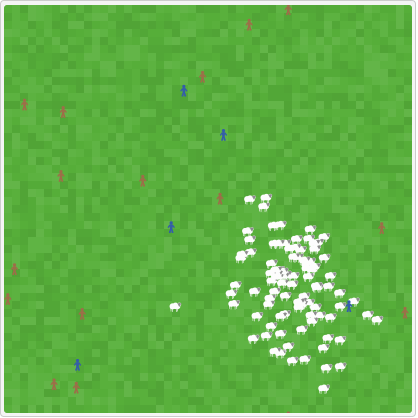
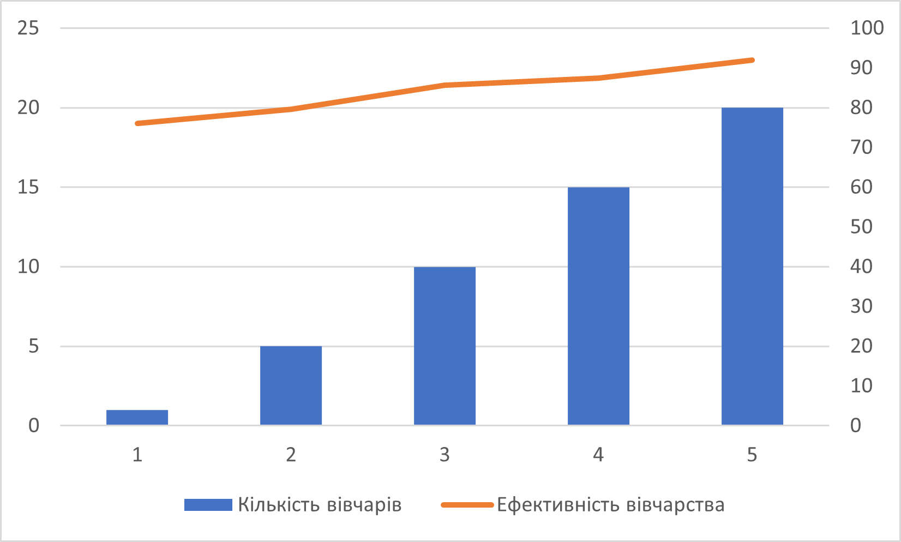
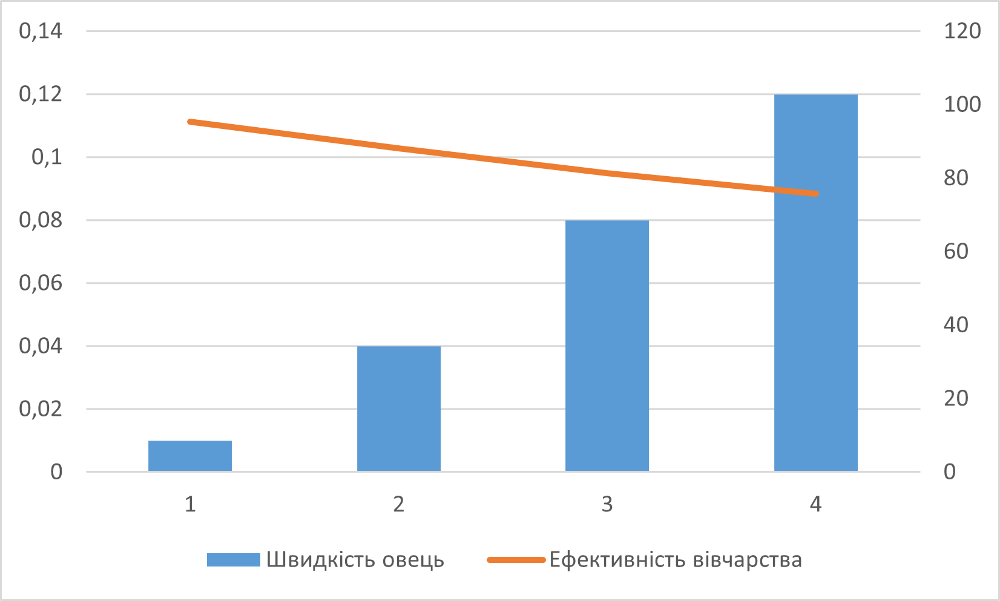
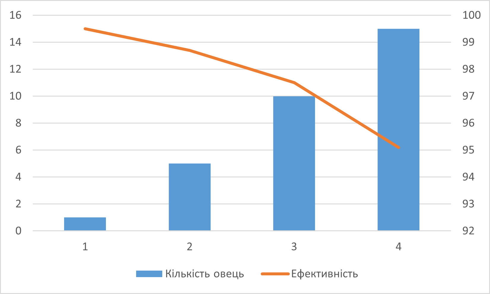

## СПм-22-6, Тухтаров Владислав Борисович
### Лабораторна робота №**1**. Опис імітаційних моделей та проведення обчислювальних експериментів

 

### Варіант 9, модель у середовищі NetLogo:
[Shepherds](http://www.netlogoweb.org/launch#http://www.netlogoweb.org/assets/modelslib/Sample%20Models/Biology/Shepherds.nlogo)

 

### Вербальний опис моделі:
Цей проект заснований на двох простіших моделях: термітів, які збирають тріску на купи, і рухомих овець. У цьому проекті вівці безладно блукають, а пастухи ходять, намагаючись їх випасати. Чи опиняться вівці в одному стаді, залежить від кількості пастухів і від того, наскільки швидко вони рухаються порівняно з вівцями.
Пастухи дотримуються низки простих правил. Кожен пастух починає блукати випадковим чином. Якщо він натикається на вівцю, він підбирає вівцю та продовжує безладно блукати. Коли він натикається на іншу вівцю, він знаходить вільне місце поблизу, кладе свою вівцю та шукає іншу.

### Параметри Setup:
- **num-shepherds** - кількість пастухів на початку.
- **num-sheep** - кількість овець на початку.

### Параметри, що можуть надавати вплив під час роботи симуляції:
- **sheep-speed** - Швидкість овець.

### Показники роботи системи:
- current efficiency - відображає поточну ефективність вівчарства.
- Herding Efficiency - графік, що відображає ефективність вівчарства протягом симуляції.

### Примітки:
1) Коли починають формуватися невеликі стада овець, стада ніяк не «захищені». Тобто вівчарі іноді забирають овець з уже наявних стад.
2) Якщо пастухів недостатньо, або якщо вівці рухаються досить швидко відносно пастухів, пастухи не можуть встигати за блуканнями своїх овець, і вівці розбіжаться.

### Недоліки моделі:
1) Вівці та пастухи не мають можливості розмножуватись. Можна було б спостерігати як одне покоління пастухів замінює інших та відповідну ситуацію з вівцями.
2) Відсутні хижаки, нереалістично.
3) Якщо пастухів достатньо і/або пастухи рухаються набагато швидше, ніж вівці, кількість стад з часом зменшується. Деякі стада зникають, коли пастухи забирають усіх овець. Якби вівці ніколи не рухалися, було б неможливо створити нове стадо з нуля, оскільки пастухи завжди ставлять своїх овець поруч з іншими вівцями. Отже, кількість стад з часом обов’язково зменшиться. 

## Обчислювальні експерименти
 
### 1. Знаходження мінімальної кількості пастухів, необхідних для випасу певної кількості овець.
Досліджується необхідна кількість пастухів, необхідних для випасу 30 овець протягом 10000 тактів.
Експеримент проводяться при таких параметрах:
- **num-sheep** 100
- **sheep-speed** 0,04

<table>
<thead>
<tr><th>Кількість пастухів</th><th>Ефективність</th><th>Візуальний аналіз</th></tr>
</thead>
<tbody>
<tr><td>1</td><td>76.1</td><td>Як можна побачити на скриншоті - вівчар не в змозі впоратись з поставленою задачею взагалі.</td></tr>
<tr><td>5</td><td>79.6</td><td>5 вівчарів почали збирати стадо, але багато вівець не у стаді. Тож вівчарам або потрібно більше часу, або більша швидкість, абопотрібно більше вівчарів.</td></tr>
<tr><td>10</td><td>85.6</td><td>Вівчари вже майже впоралися з задачею, але ще є декілька вівець, що постійно втикають.</td></tr>
<tr><td>15</td><td>87.5</td><td>Вівчарі вже здатні втримувати стадо. 1-7 вівець втикають, але відразу їх повертають до стада.</td></tr>
<tr><td>20</td><td>92</td><td>Вівчарі бездоганно роблять свою роботу. Достигши цього результату експеримент було вирішено зупинити.</td></tr>
</tbody>
</table>

Надлежні зображення, отримані при дослідженні:

1 пастух:

5 пастухів:

10 пастухів:

15 пастухів:

20 пастухів:

Графік:

Графік наочно показує, що чим більше вівчарів(пастухів) буде тим краще вони виконують свою роботу.

### 2. Вплив швидкості вівець на ефективність вівчарства
Досліджується вплив параметру sgeep-speed на current efficiency.
Експеримент проводяться тривалістю в 10000 тактів при таких параметрах:
- **num-sheep** 100
- **num-shepherds** 20

<table>
<thead>
<tr><th>Швидкість вівець</th><th>Ефективність</th><th>Візуальний аналіз</th></tr>
</thead>
<tbody>
<tr><td>0,01</td><td>95.3</td><td>Пастухам дуже легко втримувати повільних вівець у одному стаді.</td></tr>
<tr><td>0,04</td><td>88.2</td><td>Вже складніше, але ще можуть впоратись.</td></tr>
<tr><td>0,08</td><td>81.3</td><td>Пастухи намагаються втримувати овець у одному місці, але це дуже важко через те, що вони постійно втикають.</td></tr>
<tr><td>0,12</td><td>75.7</td><td>Немає змоги утримувати хоча б 10 овець в одному місці. Експеримент було вирішено зупинити.</td></tr>
</tbody>
</table>

Графік наочно показує, що чим більше швидкість овець тим складніше вівчарам їх втримувати.

### 3. Кількість овець, що може утриммувати один пастух у групі
Досліджуються вплив параметру num-sheep на current efficiency.
Експеримент проводяться тривалістю в 20000 тактів при таких параментрах:
- **num-shepherds** 1
- **sheep-speed** 0,02

<table>
<thead>
<tr><th>Кількість овець</th><th>Ефективність</th><th>Візуальний аналіз</th></tr>
</thead>
<tbody>
<tr><td>2</td><td>99.5</td><td>Пастух має змогу випасати двох овець.</td></tr>
<tr><td>5</td><td>98.7</td><td>Вже складніше, але пастух ще може впоратись.</td></tr>
<tr><td>10</td><td>97.5</td><td>Пастух намагається втримати овець в одному місці, але йому це погано вдається - вони постійно втикають.</td></tr>
<tr><td>15</td><td>95.1</td><td>Пастух так і не зміг створити жодного стада. На цьому експеримент було зупинено.</td></tr>
</tbody>
</table>

Під час проведення експерименту було відмічено - один пастух може випасати до 10 овець.
